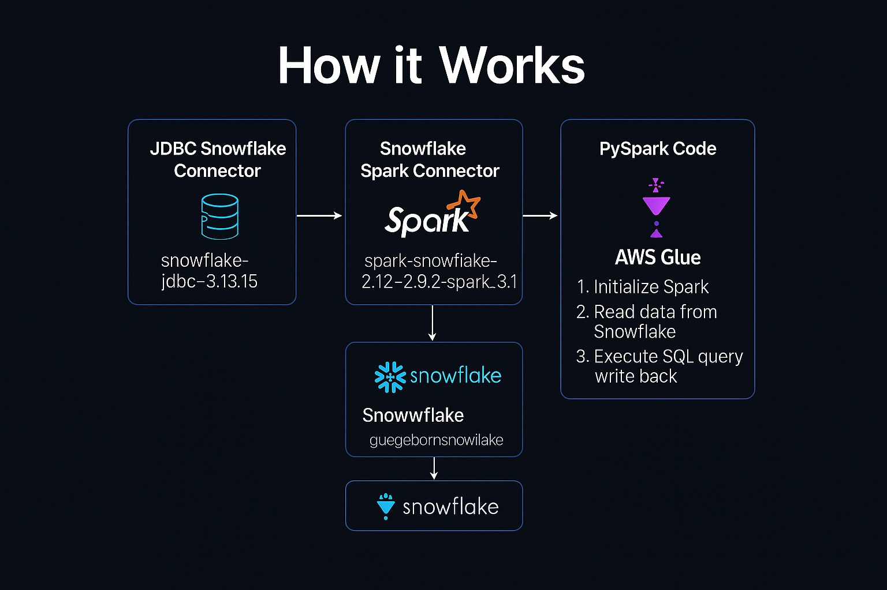

# ❄️ Snowflake Data Analysis using PySpark in AWS Glue

This project demonstrates how to integrate **Snowflake** with **Apache Spark (PySpark)** inside **AWS Glue** for performing data extraction, transformation, and loading (ETL).  
It uses JDBC and Spark-Snowflake connectors to enable bidirectional data movement between Snowflake and Glue.

This setup is commonly used by data engineering teams to process Snowflake data at scale using distributed Spark jobs.

---

## 🏗️ Architecture





**Flow Overview:**  
AWS Glue (PySpark) → Snowflake (via Spark Connector + JDBC) → Transform → Write Back

---

## 🚀 What This Pipeline Does (Simple Explanation)

1. AWS Glue job runs a **PySpark script**  
2. Spark uses:
   - **Snowflake JDBC driver**  
   - **Snowflake Spark Connector**  
3. Reads data from Snowflake tables  
4. Runs transformations / SQL queries using Spark  
5. Writes processed results back into Snowflake  

This enables scalable Snowflake analytics using Spark clusters.

---

## 📁 Repository Structure

```

Snowflake-Data-Spark-Integration/
│
├── gluejobforsnowflake.py                  # Main PySpark ETL script for Glue
├── snowflake-jdbc-3.13.15.jar              # JDBC connector for Snowflake
├── spark-snowflake_2.12-2.9.2-spark_3.1.jar # Spark-Snowflake connector
├── glue job to snowflake.png               # Architecture Diagram
├── read me..txt                            # Notes / reference
└── README.md

````

---

## 🔧 Components Used

### **1️⃣ Snowflake JDBC Connector**
- File: `snowflake-jdbc-3.13.15.jar`  
- Purpose: Enables low-level JDBC connectivity between Spark and Snowflake.

### **2️⃣ Snowflake Spark Connector**
- File: `spark-snowflake_2.12-2.9.2-spark_3.1.jar`  
- Purpose: Allows Spark to read/write Snowflake tables using Spark DataFrames efficiently.

### **3️⃣ PySpark Script (AWS Glue Job)**
- File: `gluejobforsnowflake.py`  
- Purpose: Executes Spark job to:
  - Read tables  
  - Run SQL  
  - Write processed output back to Snowflake  

---

# 🧠 How the ETL Works

### **Step 1 — Initialize Spark Session**
AWS Glue starts a distributed PySpark session.

### **Step 2 — Load Snowflake Connection Options**
Includes:
- URL  
- Username  
- Password  
- Database  
- Schema  
- Warehouse  

### **Step 3 — Read Data from Snowflake**

```python
df = spark.read.format("net.snowflake.spark.snowflake")
````

### **Step 4 — Transformations / SQL Queries**

Spark executes aggregations, filtering, joins, and SQL operations.

### **Step 5 — Write Back to Snowflake**

```python
df.write.mode("overwrite").format("snowflake")
```

---

# 📜 PySpark Code (Main Logic Overview)

```python
from pyspark.sql import SparkSession

spark = SparkSession.builder.appName("Snowflake Integration").getOrCreate()

SNOWFLAKE_SOURCE_NAME = "net.snowflake.spark.snowflake"

snowflake_database = ""
snowflake_schema = ""
snowflake_table_name = ""

snowflake_option = {
    "sfUrl": "",
    "sfUser": "",
    "sfPassword": "",
    "sfdatabase": snowflake_database,
    "sfschema": snowflake_schema,
    "sfWarehouse": ""
}

# Read table
df = spark.read.format(SNOWFLAKE_SOURCE_NAME) \
    .option(**snowflake_option) \
    .option("dbtable", snowflake_table_name) \
    .load()

# Perform SQL or transformations
sql_query = """ 
SELECT * FROM table 
"""

# Write back
df.write.format("snowflake") \
    .option(**snowflake_option) \
    .option("dbtable", "output") \
    .mode("overwrite") \
    .save()

spark.stop()
```

---

# ⚙️ How to Run This in AWS Glue

### **1️⃣ Upload Connectors**

Upload to S3 and attach to Glue job:

* `snowflake-jdbc-3.13.15.jar`
* `spark-snowflake_2.12-2.9.2-spark_3.1.jar`

### **2️⃣ Create AWS Glue Job**

Configure:

* Script: `gluejobforsnowflake.py`
* Worker type: Standard / G.1X
* Glue version: Spark 3.x
* IAM role: S3 + Snowflake permissions

### **3️⃣ Update Script with Snowflake Credentials**

Set:

* URL
* USER
* PASSWORD
* DATABASE
* SCHEMA
* WAREHOUSE

### **4️⃣ Run the Job**

It will:

* Connect to Snowflake
* Read table
* Process data
* Save results back

---

# 🧪 Testing & Validation

### ✔ Check connector loading in Glue logs

### ✔ Run Snowflake read query

```sql
SELECT * FROM MY_TABLE;
```

### ✔ Verify processed output table

### ✔ Review Glue logs for ETL success/failure

---

# 🎯 Skills Demonstrated

* Snowflake + Spark integration
* Distributed ETL using AWS Glue
* Connector-based data ingestion
* Secure external database access
* Writing DataFrames back to Snowflake
* Cloud-based data engineering patterns

---

# 📄 Resume Bullet Points

* Built an ETL pipeline using **AWS Glue PySpark** to read and write Snowflake datasets using JDBC and Spark-Snowflake connectors.
* Executed distributed SQL and DataFrame transformations at scale.
* Implemented secure connection handling and optimized Spark configuration for Snowflake workloads.

---

# 👤 Author

**Gnana Prakash N**
Data Engineer
GitHub: [gnanaprakashn](https://github.com/gnanaprakashn)

---

# 📜 License

MIT © 2025


